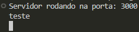

# Avaliação 2

Universidade Federal do Ceará - UFC
Linguagem de Programação Script - 2023.1

**Professor:** Ricardo Brauner dos Santos

**Aluna:** Rafaella Sampaio de Alencar _- 469886_

# Enunciado

Desenvolva um sistema cliente servidor usando uma linguagem script em que você possa submeer um trecho de código no cliente que é enviado para o servidor e executado lá retornando um valor de saida que você quiser.

## Inicialização

É necessário ter em seu computador o Node.js e o npm ou yarn.
Como não enviei a pasta node_modules, é preciso instalar na pasta do projeto as seguintes dependências:

`npm install express`
`npm install express-rate-limit`
`npm install helmet`

Como as três já constam no **package.json**, provavelmente executar `npm install` já deve funcionar.

Por fim, o seguinte comando deve executar o projeto:

`node app.js`

E então basta abrir a o endereço `http://localhost:3000` em seu navegador de preferência.

## Funcionamento

Na tela inicial, insere-se um comando único campo de texto visível:

O botão Limpar esvazia esse campo e o botão Enviar o executa.
Após a execução, a aplicação vai para outra página.

Caso haja retorno daquele comando, ele é exibido em tela:

Caso seja um comando sem retorno, é reproduzido em tela qual foi o comando executado:

